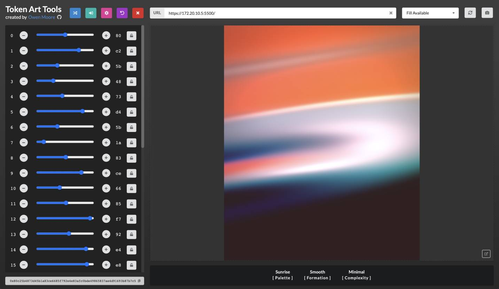

# token-art-tools
Static web application for generative artists to explore creative concepts via mappable hashpair control sliders, automate image generation and capture features information to CSV in order to analyze probablility of outcomes. Developed in React, using Gatsby and Semantic UI libraries.

https://owenmoore.github.io/token-art-tools/



# Project Configuration

This project requries a `localhost` web server to host your work and that you have imported the `lib/connector.js` script prior to executing your sketch. A globally accessible `hash` and `number` variables will be made available for your use, as well as some platform specific implementations.

## Boilerplate Setup

The following boilerplate project setup supports all of Token Art Tool's features

https://github.com/owenmoore/token-art-tools-boilerplate

## Manual Setup

The `lib/connector.js` script must be referenced in your project's index before your artwork sketch executes. Either copy it directly into your project or simply use the following CDN.

```html
<script src="https://cdn.jsdelivr.net/gh/owenmoore/token-art-tools@1.6.0/lib/connector.js"></script>
```

## Host Locally

If you want, you can also simply fork this repo and run it locally

1. `npm install`
2. `make run-server`
3. `http://localhost:8000`

## Platform Specific Features

### [Art Blocks](https://www.artblocks.io)

The globally accessible `tokenData` variable is constructed by the `lib/connector.js` script from a hash provided by this web application. All 32 hashpair sliders create the `hash` directly. The `tokenId` simulates project "0" with a possible range of "0 to 1000" even though Art Blocks technically supports up to one million mints.

```js
tokenData = {
    hash: '0x0000000000000000000000000000000000000000000000000000000000000000',
    tokenId: 1000000
}
```

To learn more about how you can use this structure, refer to [Art Block's 101 Docs](https://docs.artblocks.io/creator-docs/creator-onboarding/readme/)


### [fx(hash)](https://www.fxhash.xyz)

The globally acessible `fxhash` variable and `fxrand` function are constructed by the `lib/connector.js` script from a slice of the hash provided by this application. The script simply contains a copy of code required by fxhash with the `fxhash` variable overriden by what this application generates.

You must import / reference the `lib/connector.js` script **AFTER** the fxhash template code in order for it to work. You can otherwise use the variable fxhash provides as normal in your artwork sketch.

To learn more about how you can use fxhash variables, refer to the [fxhash guide](https://www.fxhash.xyz/doc/artist/guide-publish-generative-token)


## Technical Requirements

### Canvas is Required

Artwork must be displayed within a `canvas` element for all features to work as expected.

### preserveDrawingBuffer: true

The `preserveDrawingBuffer` must be `true` for screenshots to work.

##### ThreeJS

```javascript
 renderer = new THREE.WebGLRenderer({ preserveDrawingBuffer: true });

```

##### WebGL

```javascript
const gl = canvas.getContext('webgl', { preserveDrawingBuffer: true })
```

# Tips & Tricks

## Hashpairs

While exploring the domain of creative features, it can be helpful to map them directly to hashpairs (and thus, sliders in the interface). Being able to quickly mix the different features can help make refinements or discover new possibilities.

```js
function mpd(n, a1, b1, a2, b2) {
    return ((n - a1) / (b1 - a1)) * (b2 - a2) + a2;
}

let hs = [];

for (j = 0; j < 32; j++) {
    hs.push(hash.slice(2 + j * 2, 4 + j * 2));
}

let rns = hs.map((x) => {
    return parseInt(x, 16);
});

let features = {
    hue: mpd(rns[0], 0, 255, 0, 360),
    size: mpd(rns[1], 0, 255, 0.5, 1.8)
}
```

## Random Seed

I would not recommend using the haspair mapping suggestion above in your final work. The reason is simply because the randomization you get from an external system (such as blockchain smart contracts) may not provide reliable randomization and in some cases, can be gamed by minters. It's much better to simply implement your own random function and use the hash as it's seed directly.

Here's an excellent Random function [Piter Pasma](https://twitter.com/piterpasma) has shared with fellow Art Blocks artists.

```js
let S = Uint32Array.from([0, 0, 0, 0]).map(i => parseInt(hash.substr(i * 8 + 5, 8), 16));

let R = (a = 1) => {
    let t = S[3];
    S[3] = S[2];
    S[2] = S[1];
    let s = (S[1] = S[0]);
    t ^= t << 11;
    S[0] ^= t ^ (t >>> 8) ^ (s >>> 19);
    return (a * S[0]) / 2 ** 32;
};

console.log("new random number", R());
```

## Screenshot Delays

Getting a consistent screenshot can be tricky sometimes, especially if your artwork is particularly heavy. I suggest that you err on the side of caution and use a long wait time when automating. Also, try your settings on a smaller sample size before doing full sets.

## Features & CSV Data

The `lib/connector.js` script defines a global `features` variable which the web application polls to both display and collect for the CSV export. You **MUST NOT** redfine this variable, otherwise these features will not work. Simple assign features to this variable as soon as you can within your artwork script.

```js
features = {
    Palette: "Blue Sky",
    Style: "Shadow",
};
features['Size'] = 10;
```

You can only assign `int`, `float`, and `string` values as a feature entry.

# Known Issues

- When using a simple web server (ex: `python -m http.server 5500`), Chrome will block HTML files within iframes. At the time of writing, Firefox will still allow this, but it's much better to simple use a `node` project setup.