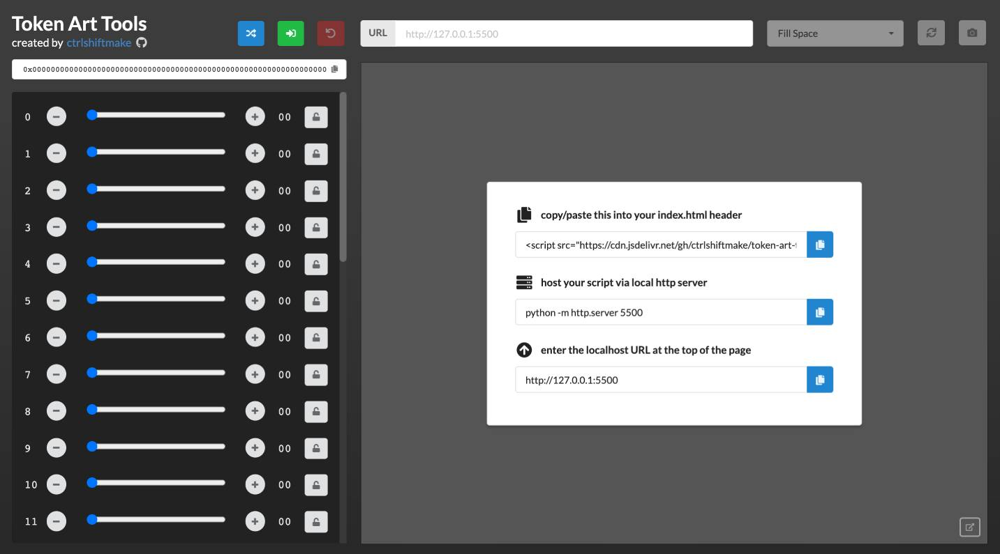

# token-art-tools
React Gatsby static web tool for generative artists working on token/hash based NFT artwork (ex: Artblocks)

https://ctrlshiftmake.github.io/token-art-tools/



## Using the Application

Your `index.html` file needs the following script in it's header to get the generated hash

```javascript
<script>
    const params = new URLSearchParams(window.location.search);
    tokenData = { hash: params.get("hash") };
</script>
```

Host your generative artwork script via a local HTTP server, for example:

```python
python -m http.server 5500
```

Copy/paste the resulting localhost URL into the application

```
http://localhost:5500
```
Use the controls provided to manipulate the hash and see how your artwork updates

## Running App Locally

1) Clone / fork repository
2) `npm install`
3) `make run-server`
4) Open `http://localhost:8000`

## Version 1.0 Features

If you have any feature suggestions, or discover bugs, please create a GitHub issue.

- [x] README preview and instructions
- [x] HashPair Controls
- [x] ArtBlocks Token Format
- [ ] Lock hash at index
- [ ] Favourite Hash
- [ ] Favourite URL